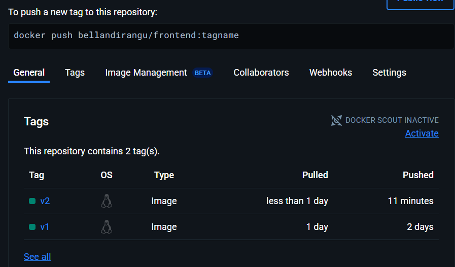
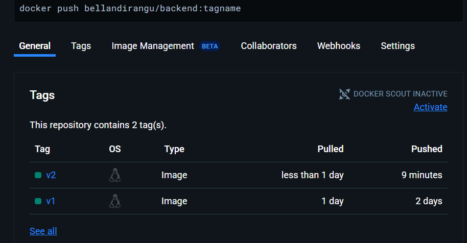

# Explanation of Docker Implementation for YOLO E-commerce App

## 1. Choice of Base Images

### Backend
- **Build Stage:** Uses `node:14` because it is stable and compatible with the backend dependencies.
- **Production Stage:** Uses `alpine:3.16.7`, a minimal and secure Linux distribution. This reduces image size and attack surface.

### Frontend
- Similar multi-stage approach using `node:14-slim` in the build stage and `alpine:3.16.7` for production. This setup ensures smaller image size and faster deployments.

---

## 2. Dockerfile Directives

Each service has a multi-stage Dockerfile with the following structure:

### Build Stage
- `FROM node:14` or `node:14-slim`: Ensures dependency compatibility.
- `WORKDIR /usr/src/app`: Sets working directory.
- `COPY package*.json ./` and `RUN npm install`: Installs only the necessary dependencies.
- `COPY . .`: Adds the full source code for build.

### Production Stage
- `FROM alpine:3.16.7`: Starts clean environment.
- `RUN apk add --no-cache nodejs npm`: Adds Node.js only for runtime.
- `COPY --from=build`: Brings in the fully built app.
- `EXPOSE`: Opens relevant ports (`3000` for frontend, `5000` for backend).
- `CMD`: Starts the server with `node server.js` or `npm start`.

---

## 3. Docker Compose Setup

`docker-compose.yml` orchestrates the application as three services:

- `brian-yolo-client`: Frontend React app
- `brian-yolo-backend`: Node.js backend service
- `app-ip-mongo`: MongoDB service

### Key Features
- **Networking:** Uses a custom bridge network (`app-net`) for isolated, internal communication.
- **Volumes:** MongoDB data is persisted using named volumes (`app-mongo-data`).
- **Ports:** Services are exposed via:
  - Frontend: `localhost:3000`
  - Backend: `localhost:5000`
  - MongoDB: `localhost:27017`

---

## 4. DockerHub Integration

The Docker images were built locally and pushed to DockerHub:

- `bellandirangu/backend:v1`
- `bellandirangu/frontend:v1`

This allows anyone to deploy without cloning the full repo by pulling these images and using the `docker-compose.yml`.

---

## 5. Git Workflow and Tags

The GitHub repository:
- Includes all relevant files: Dockerfiles, `docker-compose.yml`, and this explanation.
- Uses meaningful commit messages and a tagged release (`v1.0.0`) for versioning.
- All changes were committed and pushed after building and verifying Docker images.

---

## 6. DockerHub Images

Below are screenshots showing the Docker images for both the frontend and backend, each tagged with `v2` as uploaded to DockerHub.

### Frontend v2 Image


### Backend v2 Image



## 7.  Key Progress (May 5)
<!--  Docker Work -->
Cleaned up Dockerfiles

Rebuilt and pushed updated images to DockerHub (v3)

Confirmed full local deployment using docker-compose

<!-- Ansible Implementation (New Today!) -->
<!-- Created Ansible Playbooks & Roles: -->
Role-based structure: roles/client, roles/backend, roles/mongo

Each role contains tasks, handlers, and templates as needed

<!-- Configured group_vars: -->

Separated variables for each host group

Used .env-like structure to centralize config

<!-- Ran Ansible Playbook: -->

Used ansible-playbook site.yml to set up and configure containers automatically

Verified each container was built, configured, and started successfully

<!-- Benefits: -->

Easy repeatable deployment across environments

Centralized config and clear infrastructure-as-code (IaC) structure

Prepared for future use with remote servers or cloud instances


## 8. Best Practices

- Used multi-stage builds for smaller, secure images.
- Only essential files copied to production containers.
- Network isolation with a custom Docker bridge.
- Clear port mapping for local development.
- Persistent storage for database using Docker volumes.
- Docker Compose for simplified orchestration and reproducibility.

---

## 9. How to Run locally

'''bash
# Clone the project
git clone https://github.com/Bella-oreo/yoloproject.git
cd yoloproject

# Start services using Docker Compose
docker-compose up --build

## Access the app:

Frontend: http://localhost:3000

Backend API: http://localhost:5000 -->


# Stage 2 Explanation: Ansible & Terraform Instrumentation

## Objective:
The goal of **Stage 2** was to integrate **Terraform** and **Ansible** to provision and configure the infrastructure and application. By the end of this stage, the entire setup process is automated using a single command that provisions the environment and deploys the application.

## Workflow:
The **Terraform** module provisions the infrastructure and creates the server (VM), while **Ansible** is used for configuring the server, deploying Docker containers, and setting up the web application.

### 1. **Terraform Setup**:
- **Resources Provisioned**: We used Terraform to provision a VM on which the application will run. Terraform handles the initial infrastructure setup and ensures that the required environment (VM) is created.
  
- **Terraform Provisioner for Ansible**: Terraform doesn't have a native provisioner for Ansible. To overcome this, used the **remote-exec** provisioner within Terraform to trigger the execution of the Ansible playbook once the resources have been provisioned.

  - **Terraform Configuration**: The `main.tf` file contains the configurations for provisioning the VM, setting up the network, and defining the provisioning behavior using **remote-exec**.

### 2. **Ansible Playbook Setup**:
- The **Ansible playbook** is responsible for configuring the newly provisioned resources (VM) and deploying the e-commerce web application.
  
- **Roles**:
  - **Docker Role**: Configures Docker on the VM.
  - **App Role**: Deploys the e-commerce application and ensures all services are running correctly in their respective Docker containers.
  
- **Variables**: Variables were used for flexibility and reusability across the playbook. For example, container images and ports can be easily changed using variables defined in the `variables.yml` file.

### 3. **Playbook Execution**:
- After provisioning the VM using **Vagrant** and **Terraform**, the Ansible playbook is executed:
    ```bash
    ansible-playbook ../ansible/playbook.yml -i ../ansible/inventory.ini
    ```

- The playbook ensures that the web application is deployed and accessible on the browser. This includes configuring Docker containers for each component of the application.

### 4. **Role of Each Task**:
- **Docker Configuration**: Ensures that Docker is installed and configured to run containers for the web application.
- **Application Deployment**: Deploys the containers (web app, database, etc.) using Docker commands specified in the Ansible playbook.

### Key Modules and Concepts Used:
- **Variables**: Used in the playbook for defining reusable values such as container names, images, and ports.
- **Roles**: Used to modularize tasks, making it easier to manage and scale the playbook.
- **Blocks**: Grouped tasks into blocks to handle exceptions or failures.
- **Tags**: Added tags to tasks for targeted execution.
  
### Explanation for Role Order in the Playbook:
1. **Docker Setup**: Docker must be set up first because all containers depend on it.
2. **App Setup**: Once Docker is running, the application can be deployed within containers.
3. **Service Verification**: After deployment, the services are verified to ensure the application is running as expected.

### Conclusion:
This stage automated the entire environment setup, from provisioning to configuration and deployment, using **Terraform** for infrastructure and **Ansible** for configuration management. The project is now ready for deployment with a single command to provision and configure the server and launch the application.


